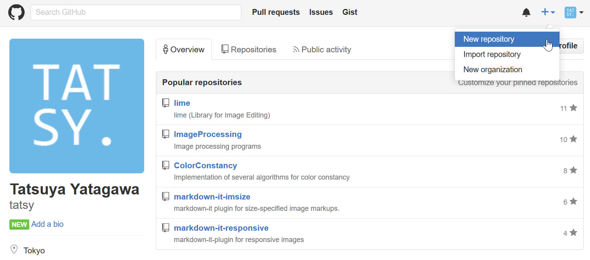
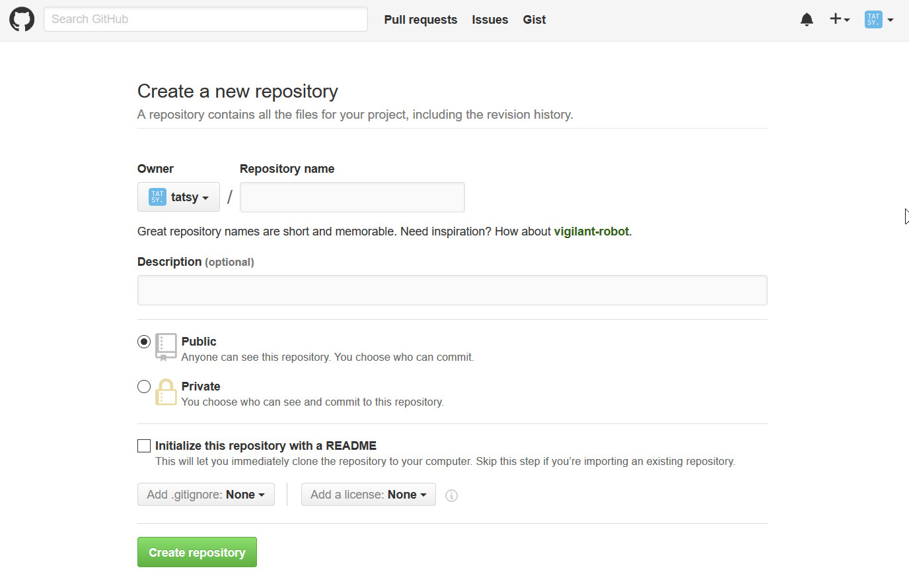
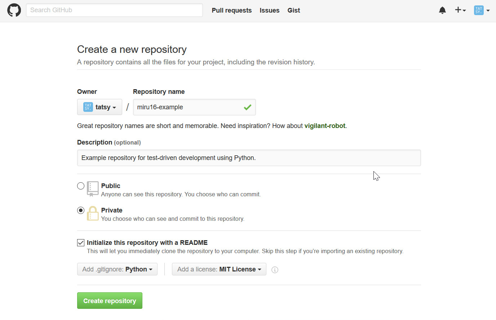

******************
1. レポジトリの作成
******************

1-1. レポジトリを作る
------------------

まず GitHub_ を開き，右上にある「＋」ボタンをクリックします．するとドロップダウン
メニューが表示されるので，その中から「New repository」を選びます．

.. _GitHub: https://github.com/

1-2. レポジトリの初期設定
----------------------

すると以下のようなレポジトリの設定画面が現れるので必要事項を入力します．今回は
「README.md」と「.gitignore」，「LICENSE」の3つのファイルを自動生成してもらうことに
します．言語と対応するライセンスの種類を選ぶと，これらのファイルが自動性セされます．

1-3. 設定完了
-------------

設定をしてみた画面は以下のようになります．この状態で「Create repository」のボタンを
押せば，レポジトリが作成されるはずです．

----

目次に戻る_

.. _目次に戻る: ../README.rst
