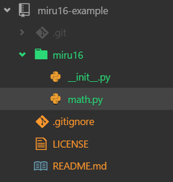
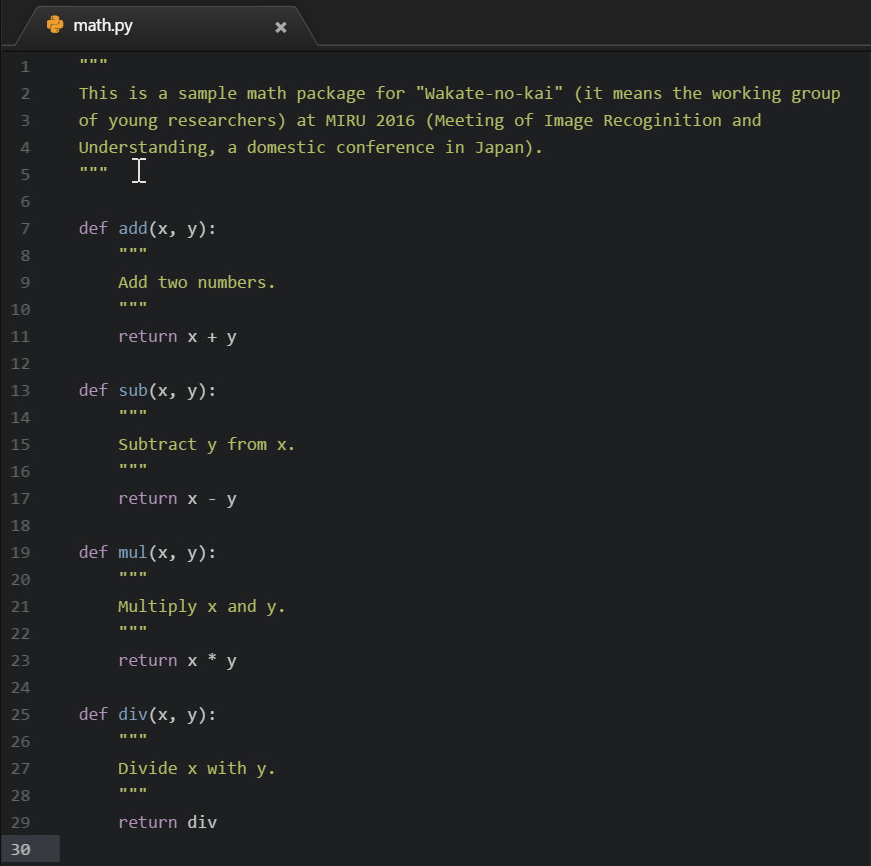
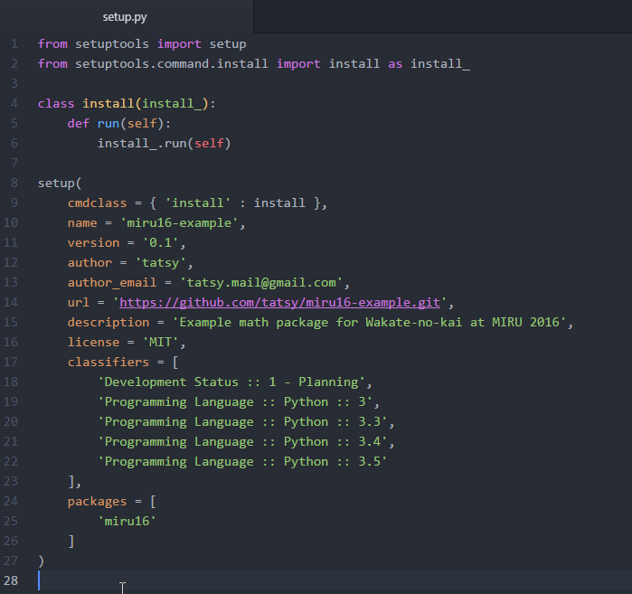
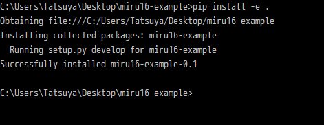

**************
2. コードの作成
**************

2-1. サンプル数学ライブラリの作成
-----------------------------

今回はサンプルとして単純な四則演算のライブラリを作成します．プロジェクトのルートディレクトリに**miru16**
というディレクトリを作成して，その中に**__init__.py**と**math.py**というファイルを作ります．ファイル作成後の
フォルダ構成は次のようになっているはずです．

**__init__.py**はライブラリ探索用のファイルなのですが，今回は何も書かなくて大丈夫です．**math.py**
の方については以下のように内容を入力しました．

2-2. インストール用スクリプトの作成
------------------------------

次にプロジェクトのルートディレクトリに**setup.py**というファイルを作成して，次のような内容を入力します．

2-3. 作成したライブラリのインストール
-------------------------------

これでライブラリをインストールする準備が整いました．ライブラリはプロジェクトのルートディレクトリに戻り，
**pip**を使って次のようにインストールをします．

.. sourcecode::shell
  $ pip install -e .

正しくコードが書けていれば次のような出力がでて，インストールが成功するはずです．

----

目次に戻る_

.. _目次に戻る: ../README.rst
