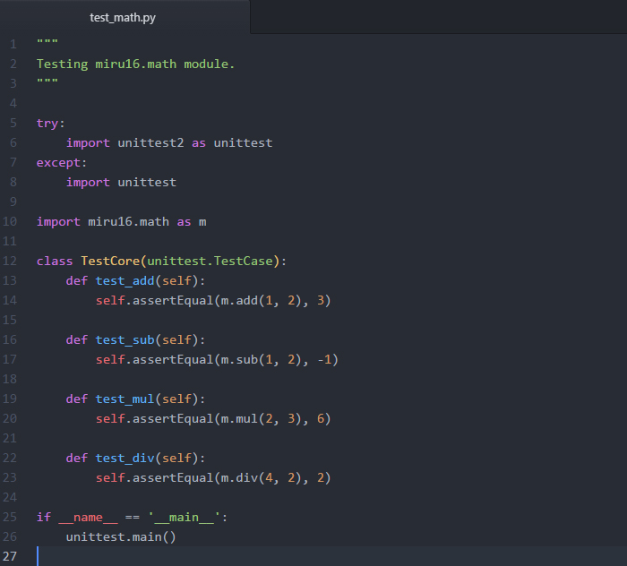
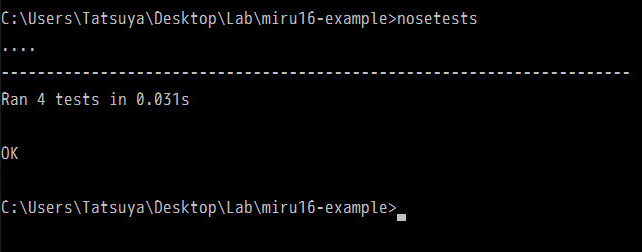

*******************
3. テストの作成と実行
*******************

3-1. Pythonでのテスト環境について
------------------------------

今回はPythonのテストフレームワークである**nose**を使ってテストを実行します．テストを実行するには，
pipを使用していれば，

.. sourcecode:: shell
  $ pip install nose

で**nose**がインストールできます．また，AnacondaやMinicondaなどの仮想環境を使っている場合には，

.. sourcecode:: shell
  $ conda install nose

でインストールできます．

3-2. テストを書く
---------------

今回は四則演算のテストとして以下のようなテストを書きました．

テストを作成するためには**unitest**モジュール内の**TestCase**クラスを継承したクラスを作ります．
このクラス内の個々のメソッドが1つ1つのユニットテストになります．各ユニットテスト内では**assertEqual(a, b)**
という関数を使って*a*と*b*の値が等しいかどうかを評価しています．

3-3. テストの実行
----------------

テストの実行方法はいたって簡単です．ライブラリをインストールした状態で，レポジトリのルートディレクトリに
移動し，以下のコマンドを入力します．

.. sourcecode:: shell
  $ nosetests

テストが上手く実行できると，次のような出力が出るはずです．

----

目次に戻る_

.. _目次に戻る: ../README.rst
